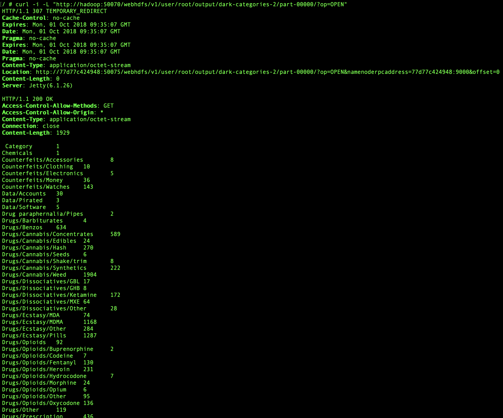

The main topic of this post is HttpFS.

This post will show you, how to...

* ... start a Docker container linked to another one
* ... use HttpFS for receiving data
* ... receive results via HttpFS using cURL

{:class="img-responsive"}

## What is HttpFS?

*Hadoop HDFS over HTTP*, short *HttpFS*, provides a REST HTTP gateway supporting all filesystem operations, that can be performed in HDFS. 

In this tutorial we want to have a look at exploring directories and fetching data via HttpFS.

## Prerequisites

This tutorial is based on the two posts before, therefore please follow the instructions of
* [Part 1](../Hadoop-Part-1)
* [Part 2](../Hadoop-Part-2)

before going on with this one.

## Get Results via HttpFS

### Prerequisites

To explore HttpFS, we are going to use another Docker container, linked to the Docker container of [part 1](../Hadoop-Part-1) of the tutorial series. 
We will fetch the results created in [part 2](../Hadoop-Part-2) of this tutorial series.

> The Docker container, we are using, has to be slightly adapted to make the access from another container possible:  
> The file `$HADOOP_CONF_DIR/core-site.xml` has to be changed:
> ```xml
> <configuration>
>   <property>
>       <name>fs.defaultFS</name>
>       <value>hdfs://0.0.0.0:9000</value>
>   </property>
> </configuration>
> ```

### Starting a linked Docker container

Let's start a Docker container linked to the already running container one, which contains Hadoop.

1. Get the ID or name of the container running Hadoop. (`docker ps` or `docker container ls` will help you)
2. Start a linked container:
    ```shell
    docker run -it --link <docker-container-name>:<internal-name> --name <name-of-container-starting> <image-to-start>
    ```
    **Explanation of variables**
    * `docker-container-name`  
      The name or ID, you discovered in step 1  
      Example: *sleepy_hopper* 
    * `internal-name`  
      Name to reference the already running container in the new container  
      Example: *hadoop*  
    * `name-of-container-starting`  
      The name of the container  
      Example: *dora_the_explorer*  
    * `image-to-start`  
      The image to start in the container    
      Example: *openjdk:8-jre-alpine*  

    > `-it` will get you into the shell of the container, when it is started.

### Receive results via cURL

The tool, that we will use to explore results from another Docker-container is cURL. This is a command line tool, so we have to get a bash inside the running container.

> cURL is a tool, which is used in command line and scripts to transfer data. It is often used to perform HTTP-requests.  

> If cURL is not installed on the machine, please install it. For *Alpine* images `apk add curl` will do the trick.

To identify folders and their content, simply run the command:
```shell
curl -i -L "http://<container-name>:50070/webhdfs/v1/user/root/<output-folder>/?op=LISTSTATUS"
```
Please replace `<output-folder>` with the name of the output-folder, you created last time. If you omit `<output-folder>`, the content of `user/root`-directory will be requested.

> What are the options `-i` and `-L` for?
> * `-i` will display the Http Response Headers
> * `-L` will perform the same request automatically again, if the server responds with *page moved*

If you specify the `<output-folder>`, the result will look like this:
```json
{
    "FileStatuses": {
        "FileStatus": [
            {
                "accessTime":1536826790178,
                "blockSize":134217728,
                "childrenNum":0,
                "fileId":16981,
                "group":"supergroup",
                "length":0,
                "modificationTime":1536744260273,
                "owner":"root",
                "pathSuffix":"_SUCCESS",
                "permission":"644",
                "replication":1,
                "storagePolicy":0,
                "type":"FILE"
            },
            {
                "accessTime":1536829861444,
                "blockSize":134217728,
                "childrenNum":0,
                "fileId":16979,
                "group":"supergroup",
                "length":871,
                "modificationTime":1536744260181,
                "owner":"root",
                "pathSuffix":"part-00000",
                "permission":"644",
                "replication":1,
                "storagePolicy":0,
                "type":"FILE"
            }
        ]
    }
}
```
We receive two objects, both identify as files, this is defined by `"type":"FILE"`; `"type":"DIRECTORY"` would define a directory. The filename (or in other cases the directoryname) is defined in `pathSuffix`.

The results are stored in `part-00000` in this case. The following request reveals the file content:

```shell
curl -i -L "http://<container-name>:50070/webhdfs/v1/user/root/<outpuf-folder>/part-00000?op=OPEN"
```

By setting the opening mode (`op`) to `OPEN` instead of `LISTSTATUS`, we receive the content of the file. Now we get the results as response.

{:class="img-responsive"}

### Handle results in application

By building an HTTP client, you can now receive the results from another application easily. Due to the fact that you are able to use HTTP, you can use any programming language, you want, that is able to send and receive HTTP requests/responses.

Here is some example for going on, when you received the results in your application:

Fetch lines of the response:

```java
String[] lines = result.trim().split("\n");
```

Get key and value for one line:

```java
String key = line.trim().split("\\s+")[0];
String value = line.trim().split("\\s+")[1];
```

Now, that you can receive your data via HTTP, you can build your application to display the data in any language you want to, the only requirement is, that it must be capable of being a HTTP client.

## What's up next?

Not everyone likes Java, but everyone wants to build MapReduce jobs.  
Good news - There is another way besides using the Java API, to create MapReduce jobs.